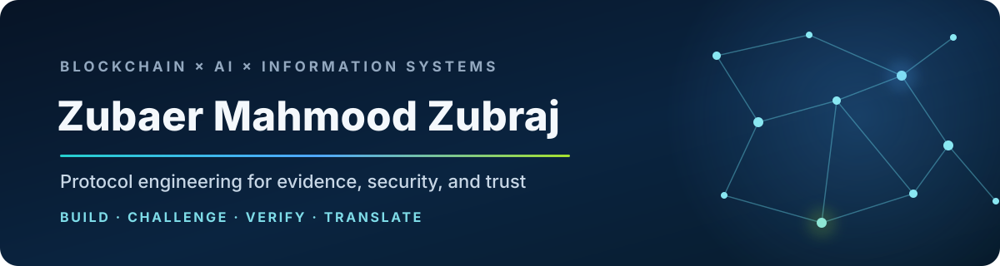

<div align="center">



### Senior Blockchain Architect · Protocol Engineer · Information Systems Researcher

I design and study trustworthy digital infrastructure at the intersection of **DLT, AI, privacy, security, and digital finance**. My work connects 8+ years of protocol and product engineering with evidence-gated research: build the artefact, test the claim, preserve the failure boundary, and translate the result into a decision that organisations can trust.

[](https://orcid.org/0009-0004-3251-3385) [](https://doi.org/10.3390/digital6010003) [](mailto:zmzubraj@gmail.com) [](https://github.com/zmzubraj)

**Open to doctoral research in Information Systems Engineering in Luxembourg and senior international Blockchain × AI R&D roles.**

</div>

## Research thesis

> **What evidence should an AI-linked blockchain system expose before an organisation can safely trust a governance, settlement, or protocol decision?**

I am especially interested in research that combines **Design Science Research**, reproducible prototypes, quantitative evaluation, formal and adversarial analysis, and qualitative inquiry into institutional adoption. The recurring goal is practical: move decentralised AI and digital-finance systems from persuasive demos to bounded, auditable claims.

## Research portfolio

| Programme | Research contribution | Current evidence boundary |
|---|---|---|
| [**APOLLO**](https://github.com/zmzubraj/APOLLO_Gov_Proposal_System) | LLM-assisted analysis, forecasting, and drafting for on-chain governance | **Peer-reviewed** in *Digital* — [DOI: 10.3390/digital6010003](https://doi.org/10.3390/digital6010003) |
| [**ChronosAudit**](https://github.com/zmzubraj/ChronosAudit) · [TemporalClone MPP](https://github.com/zmzubraj/ChronosAudit-Temporalclone-mpp) | Pre-incident smart-contract evaluation; temporal, identity, and proxy-linkage audits of a frozen 417-incident cohort | Reproducible research artefact; independent adjudication and release gates remain open |
| [**Composable Assurance for CBDC**](https://github.com/zmzubraj/Composable-Assurance_CBDC) | Evidence-gated qualification across settlement, privacy, compliance, policy, and operational layers | Author working paper and prototype; novelty, field validation, and submission gates remain open |
| [**Proof of Intelligence MPP**](https://github.com/zmzubraj/PoI-mpp-publication-artifacts) | Single-pass AI execution, evidence capsules, post-commit audit, dispute, availability gating, and bounded consensus credit | Development artefact that preserves supported, inconclusive, and negative results; not publication-ready |
| [**Assurance-Lattice Receipts**](https://github.com/zmzubraj/Assurance_lattice_receipts_EVM_inference-credit) | Typed, non-compensating receipts for fail-closed EVM inference credit | 729-state Python/Solidity development study; novelty and independent replication unresolved |
| [**KEYSTONE**](https://github.com/zmzubraj/KeyStone) | Auditable dispute-key availability for encrypted AI rollups | Pre-manuscript MPP; distributed validation, formal completion, and independent cryptographic audit pending |

<sub>Research-status labels are deliberate. A clean build or passing local test is engineering evidence—not peer review, field validation, production safety, or editorial acceptance.</sub>

## From protocol artefact to organisational evidence

```text
significant problem
      ↓
protocol / system artefact
      ↓
falsifiable claim + threat model
      ↓
reproducible evaluation + negative results
      ↓
bounded evidence for technical and organisational decisions
```

This is where my engineering background meets Information Systems Engineering: decentralised technologies are not only code and cryptography; they are socio-technical systems shaped by governance, incentives, regulation, institutions, users, and public value.

## Senior Blockchain × AI engineering

- **Protocol architecture:** consensus, cryptoeconomic incentives, governance, evidence/receipt lifecycles, Layer 2, sharding, and decentralised AI execution.
- **Smart contracts and DeFi:** Solidity/EVM systems, token standards, AMMs, lending/borrowing, staking, DAOs, testing, and adversarial design review.
- **AI systems:** LLM agents, governance automation, inference provenance, privacy-aware AI workflows, browser ONNX inference, and reproducible model evaluation.
- **Security and privacy:** threat modelling, invariants, fail-closed gates, zero-knowledge and threshold-cryptography concepts, encrypted computation, and benchmark validity.
- **Technical leadership:** architecture ownership, multidisciplinary collaboration, research-to-prototype translation, delivery planning, and technical communication.

### Professional trajectory

| Role | Focus |
|---|---|
| **Lead Senior Blockchain Architect & Protocol Engineer — LightChain AI** | AI-native protocol architecture, consensus, execution, privacy, scalability, and evidence/receipt design |
| **Chief Technical Officer (Blockchain) — FameGuild** | AI × Web3 R&D, hybrid consensus, DeFi, NFT infrastructure, and multidisciplinary engineering leadership |
| **Lead Blockchain & dApp Developer — HSR Labs** | DeFi integrations, smart contracts, trading systems, asynchronous data pipelines, and team leadership |
| **CTO & Blockchain Expert — ZTech Incorporation** | Protocol R&D, tokenomics, governance, smart-contract systems, and research-to-product strategy |

### Selected public engineering evidence

- [**APOLLO Governance System**](https://github.com/zmzubraj/APOLLO_Gov_Proposal_System) — original Python/LLM/Web3 governance implementation connected to the peer-reviewed paper.
- [**IsItAI**](https://github.com/zmzubraj/IsItAI) — original TypeScript/Next.js application with client-side ONNX inference and privacy-preserving local image analysis.
- [**AMM DEX V2**](https://github.com/ZTech-Inc/AMM_DEX_V2) — Solidity/EVM AMM, Hardhat testing, and deployment work with commit-linked contribution evidence.
- [**LightChain protocol ecosystem**](https://github.com/lightchain-protocol) — public team contributions spanning node onboarding/staking, AIVM inference, challenge-bond escrow, typed dApps, and protocol-support tooling.

## Methods and technology

<div align="center">

   

   

</div>

**Research methods:** design science · claim-to-evidence mapping · state-space exploration · simulation · controlled prototypes · sensitivity and boundary analysis · reproducible benchmarking · quantitative data pipelines · negative-result preservation

## Academic foundation

- **MBA, Human Resource Management** — International Islamic University Chittagong
- **BSc, Electronic & Telecommunication Engineering** — East Delta University
- **BBA, Finance, Banking & Insurance** — University of Information Technology & Sciences

This engineering-and-management foundation supports the kind of interdisciplinary work I value most: connecting technical design with organisational adoption, governance, financial systems, security, and societal impact.

## Current collaboration interests

I welcome research and R&D collaboration in:

- trustworthy GenAI and machine learning in organisational workflows;
- DLT/blockchain, digital identity, fintech, CBDC, and public-sector information systems;
- privacy, cybersecurity, verifiable AI, and decentralised infrastructure;
- design-science artefacts evaluated with honest, reproducible, mixed-method evidence.

<div align="center">

### Build the system. Challenge the claim. Preserve the evidence.

[**Read the APOLLO paper**](https://doi.org/10.3390/digital6010003) · [**Explore the research**](https://github.com/zmzubraj?tab=repositories) · [**Start a conversation**](mailto:zmzubraj@gmail.com)

</div>
